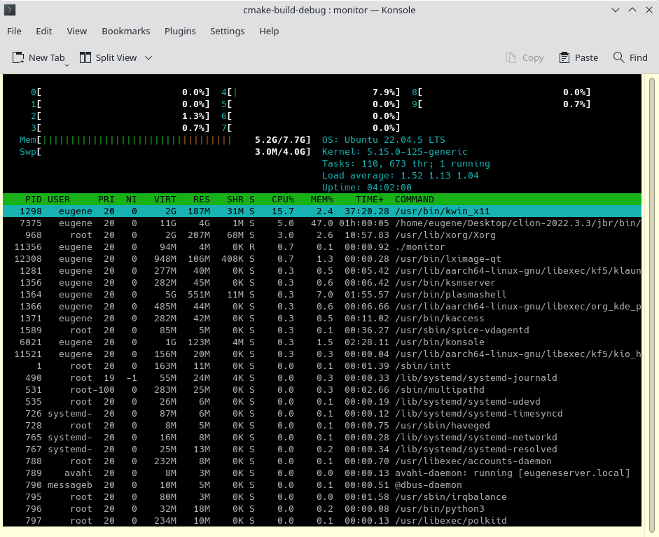

# Monitor - A Terminal-Based Process Monitoring Tool



## Overview

**Monitor** is a terminal-based process monitoring tool written in **C++** using the **ncurses** library. It is inspired by utilities like `htop` and `top` and provides real-time insights into system processes, memory usage, CPU utilization, and other critical metrics.

This project demonstrates advanced programming concepts like multithreading, terminal UI design, and event-driven architecture.

---

## Features

- **Dynamic Terminal UI**:
    - A clean, color-coded interface for an organized view of system information.
    - Auto-adjusts to terminal resizing with smooth scrolling.

- **Process Management**:
    - Displays a list of processes with details like PID, CPU%, MEM%, time, and command.
    - Use arrow keys to navigate through the list of processes.

- **Resource Monitoring**:
    - Shows live memory and CPU usage in a graphical format.
    - Displays system-level metrics like OS version, kernel version, uptime, load average, and more.

- **Multithreaded Event Handling**:
    - Separate threads for key scanning, screen redrawing, and handling terminal resizing events.
    - Event queue ensures smooth and responsive operation.

- **Customizable and Extendable**:
    - The modular design makes it easy to add new features or adapt the tool to specific needs.

---

## How It Works

- **Keybindings**:
    - Use `↑` and `↓` to navigate through processes.
    - Press `q` to exit the program.
    - The selection automatically adjusts when reaching the bottom or top of the visible list.
    - Resizing the terminal dynamically repositions and redraws all elements.

- **Thread Management**:
    - Three threads run concurrently along with the main thread to handle user input, refresh the display, and adjust to window resizing, ensuring a seamless experience.

---

## Technologies Used

- **C++**
- **ncurses** for terminal UI
- **Multithreading** with `std::thread`
- **Synchronization mechanisms** with `std::condition_variable`, `std::mutex`, and pipes among others.

---

## Challenges and Solutions

### Challenges:
1. **Handling Terminal Resizing**:
    - Ensured the UI adapts dynamically when the terminal size changes, keeping all elements visible and functional.
    - Adjusted the scroll offset and selection when the window height is reduced.

2. **Smooth Scrolling**:
    - Implemented precise control for scrolling to avoid overshooting or skipping processes.

3. **Concurrency**:
    - Designed a thread-safe event queue to handle asynchronous input and redraw events.

### Solutions:
- Used `std::mutex` for thread synchronization.
- Built a robust event-driven architecture to manage user interactions and redraws efficiently.

---

## Screenshot

Here’s how **Monitor** looks in action:


---

## How to Build and Run

### Prerequisites
- A C++17-compatible compiler.
- The `ncurses` library installed on your system.

### Build Instructions

   ```bash
   git clone https://github.com/GeneRaskin/monitor.git
   cd monitor
   mkdir build
   cd build
   cmake .. && make
   ./monitor
